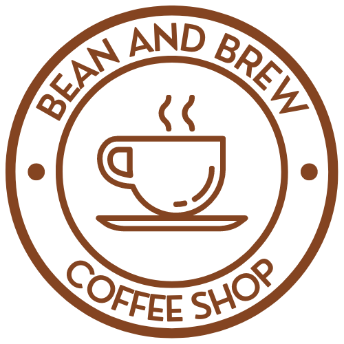

<!-- PROJECT LOGO -->
 

  

  <h3 align="center">Bean & Brew</h3>

<!-- ABOUT THE PROJECT -->
## About The Project

Static version of Bean & Brew

### Built With
* [![Bootstrap][Bootstrap.com]][Bootstrap-url]
* 
* 
* 
* 
* 

### Assets Used
- _(source: [pikwizard](https://pikwizard.com/photo/cafe-interior/7a83372de38d9fda2b527f7941799aea))_
- _(source: [pixabay](https://pixabay.com/photos/cafe-barista-coffee-shop-counter-1869656/))_
- _(source: [pixabay](https://pixabay.com/photos/coffee-beans-cup-coffee-cup-coffee-2258839/))_
- _(source: [pixabay](https://pixabay.com/photos/coffee-cafe-hot-mug-cup-white-2589759/))_
- _(source: [unsplash](https://unsplash.com/photos/_hnL_961xTk))_
- _(logo from: [Canva](https://www.canva.com/policies/content-license-agreement/))_

### Issues

See the [open issues](https://github.com/blindninja616/bean-and-brew-demo/issues).

<!-- MARKDOWN LINKS & IMAGES -->
<!-- https://www.markdownguide.org/basic-syntax/#reference-style-links -->
[Bootstrap.com]: https://img.shields.io/badge/Bootstrap-563D7C?style=for-the-badge&logo=bootstrap&logoColor=white
[Bootstrap-url]: https://getbootstrap.com
